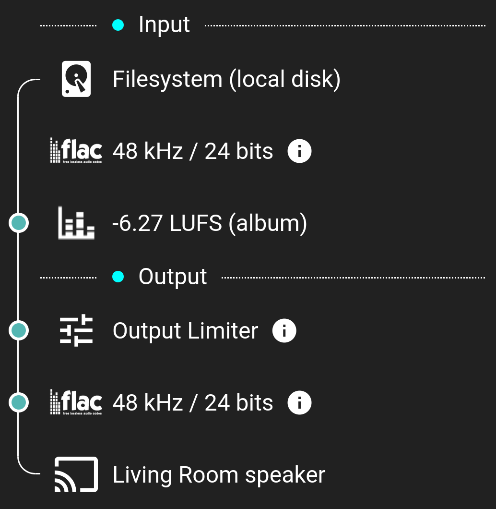
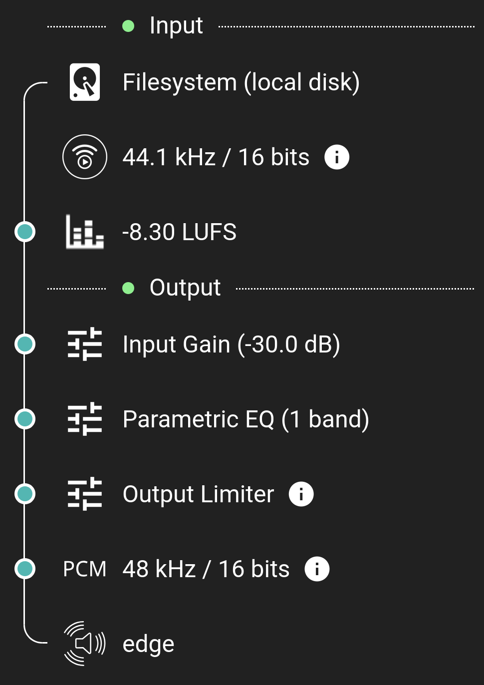
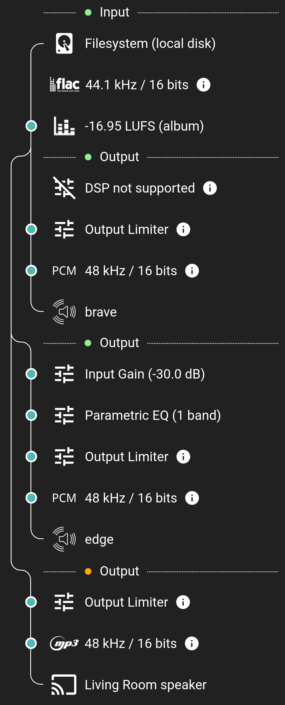

# Audio Pipeline

## Basic View
{ width=500 }

This view shows the complete path that the audio takes. A blue dot on the line on the left shows a processing point in the pipeline.

The view is broken into two sections, Input and Output. The coloured dot on the section title indicates the quality as the audio leaves the section. Orange indicates a lossy codec is in use. Green Indicates a lossless codec is in use. Cyan indicates a lossless codec is in use and either the sample rate is above 48kHz or the bit depth is above 16 (also known as "Hi-Res").

The Input section shows the origin of the stream and the codec, [sample rate and bit depth](https://www.izotope.com/en/learn/digital-audio-basics-sample-rate-and-bit-depth.html). All tracks are processed internally as raw [PCM](https://diyodemag.com/education/what_is_pcm_pulse_code_modulation) by Music Assistant and are decoded to [32 bits floating point](https://www.youtube.com/watch?v=4YRp-FIsNDA) in the sample rate of the source. 

Next the Volume Normalization value is shown. Details about how Volume Normalization is applied can be found on the [Technical Information](faq/tech-info.md/#volume-normalization) page.

The Output section is then shown which, in this example, is simple and just shows the Output Limiter, that no change to the audio sample rate or bit depth has occurred and then finally the icon of the player provider and the name of the player is shown.

MA, by default, sends lossless audio to the player. The exact codec, sample rate or bit depth that are sent to the player depends on the player / provider and is always shown. Changes to the original audio quality may occur if the MP3 option has been selected in the player settings (See the [Groups](#groups) example below) or if the audio is resampled to match the players maximum or native sample rate or bit depth. PCM could be sent to the player although typically FLAC is used to save some bandwidth.

The maximum sample rate that can be expected can be found in the [Player Providers summary table](player-providers/index.md). This can be further limited if changes were made to the default options for the player's `Sample Rates Supported by this Player` advanced setting.
***************************************************************
## Digital Signal Processing
{ width=500 }

In this example [DSP](player-support/index.md/#dsp-settings) has been enabled. High level information about the DSP filters which have been applied are shown. A tooltip is available to explain why the DSP is not supported if that is the case (See the example below in [Groups](#groups)).

Also of note in this example is the icon shown in the input section where the codec icon is normally. This icon will be displayed when MA cannot determine the codec and can occur with container formats such as [wavpack](https://www.wavpack.com/), [m4a](https://cloudinary.com/guides/video-formats/what-is-the-m4a-format-understanding-the-difference-between-m4a-mp3-and-wav) or [DSD64](https://en.wikipedia.org/wiki/Direct_Stream_Digital).

***************************************************************
## Groups
{ width=500 }

The view will expand as necessary to show all [grouped players](faq/groups.md). In the example above three players are shown with a variety of filters, output qualities and player types.

A point to note in this example is the orange dot beside the third Output section label. Whilst no quality would have been lost due to the Output Limiter or [the upsampling to 48kHz](https://www.youtube.com/watch?v=tIIK2wuXHuY) the change to the [lossy MP3 codec](https://www.adobe.com/au/creativecloud/video/discover/best-audio-format.html) necessitates the indication that this is now only Low Quality.
