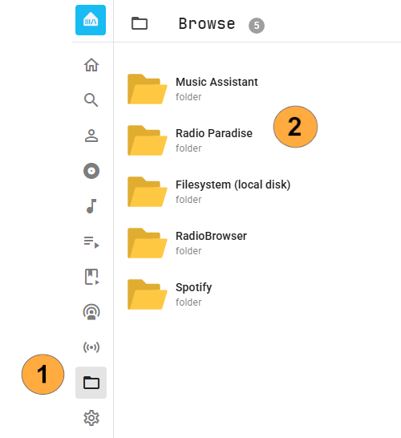

# DI.fm Network Provider { width=70 align=right }

Music Assistant has support for the DI.fm Radio Network which includes [DI.fm](https://www.di.fm), [Radiotunes](https://www.radiotunes.com), [Zen Radio](https://www.zenradio.com), [Jazz Radio](https://www.jazzradio.com), [Classical Radio](https://www.classicalradio.com), and [Rock Radio](https://www.rockradio.com). Contributed and maintained by [Ben](https://github.com/benklop)

## Features

|           |                     |
|:-----------------------|:---------------------:|
| Subscription FREE | No |
| Self-Hosted Local Media | No |
| Media Types Supported | Radio |
| [Recommendations](../ui.md#view-home) Supported | No |
| Lyrics Supported | No |
| [Radio Mode](../ui.md#track-menu) | No |
| Maximum Stream Quality | Lossy MP3 (320kbps) |
| Login Method | API Key |

### Other

- All networks are available with the one subscription and the provider allows selection of which network(s) are desired to be subscribed to

## Configuration

- In the configuration, you need to add an API key and select the desired networks

## Usage

The DI.fm provider doesn't add stations to the 'Radio' tab by default.

1. In the menu you need to select 'Browse'
2. Then click 'Radio Paradise'

    { width=400 }

3. Then navigate to the radio station you want to listen to
4. Click play now or add to library 

After adding to the library, the station will become available in the Radio view

## Known Issues / Notes

- Nil
