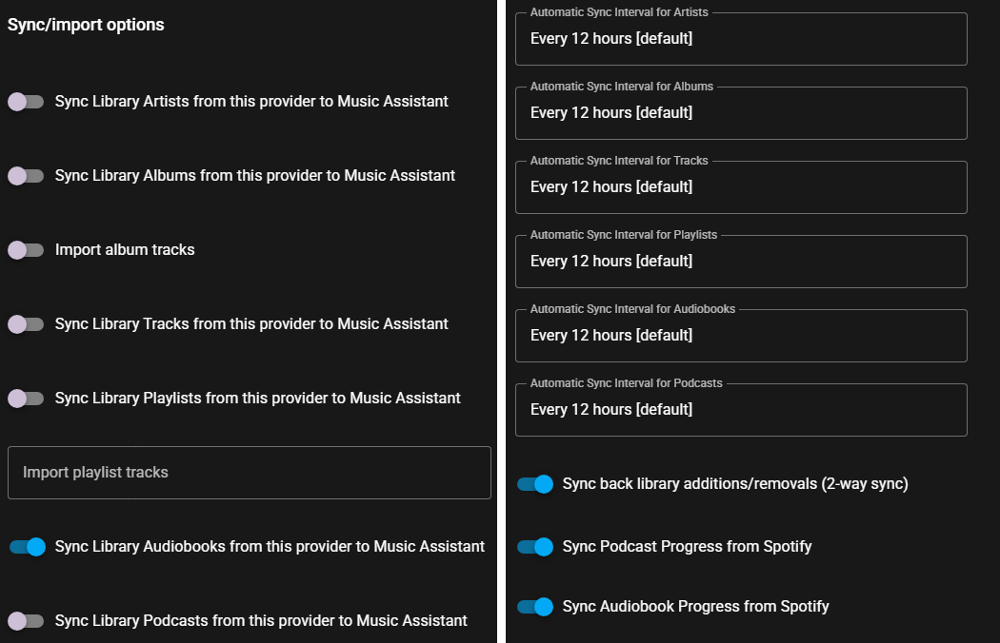
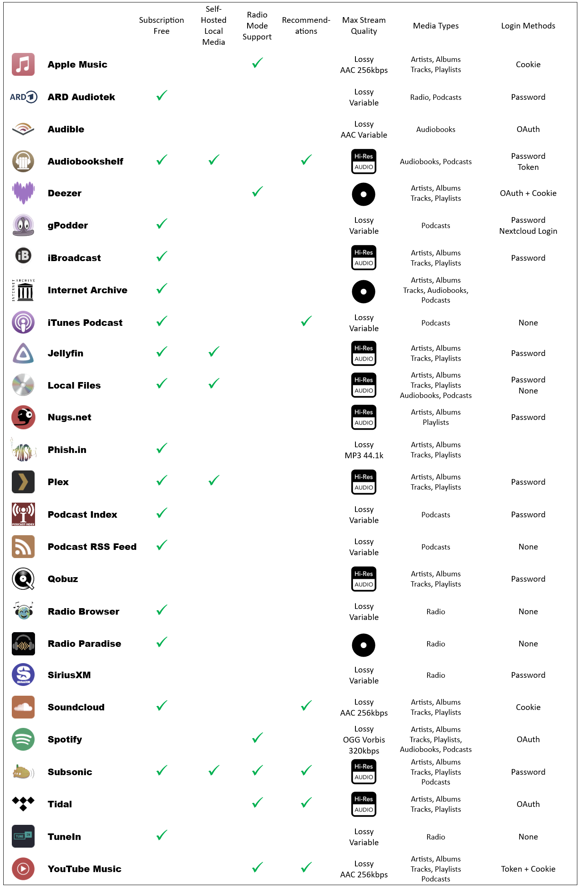

# Music Providers
<figure markdown>
  
</figure>

For specific music provider information refer to the relevant section.

General Notes:

- You have to add providers in order to access your music even if the media is visible to HA.
- If you remove a provider a cleanup of the database will be done but it takes a little time to complete. If you still see entries from a deleted provider after some time, then try a MA restart to retrigger the cleanup process.
- Music providers are added by navigating to MA Settings and then clicking on ADD MUSIC PROVIDER at the top of the page

!!! tip "Note" 
    If a problem occurs the automatic linking process may need to be initiated again. If what appears to be identical albums or tracks are seen then navigate to the album or track and using the ⋮ menu in the banner at the top of the view select "Refresh Item". This will trigger the linking process and should result in the same albums and tracks being collapsed together. Submit an issue report if this is required so that it can be investigated.

## Settings

All Music Providers have settings which can be configured. The settings page will look similar to the following. The text `Check out the documentation` is a hyperlink to the relevant page in this documentation. Specific help for a setting or configurable field is often available and is accessed by selecting this icon . All providers can be given a custom name and disabled if necessary. The log level can be adjusted for all providers and this is found in the advanced settings. (Do not select Verbose unless asked for by a dev as it can have an adverse performance impact). See the provider pages for provider specific settings.

## Library Import Control

All music providers have options to control the import of media items. The options are `Import into the library [default]`, `Import into the library, and mark as favorite`, and `Do not import into the library`. These relate to the items in the providers library (however called) and not to items which are created in the MA library as a consequence of the import. For example, if an individual track is in the provider's library (but not its associated albuum) and all of the import settings are set to mark as favorite then the individual track will be imported and marked as a favorite but the album, which will be created in the database to support the track, will not be so marked. Similarly, artists which are added to the database because they are found within a provider's playlists will not be marked as a favorite as they are not being "imported".

These settings relate to when the item is added or changed in the MA database (which in turn is updated when changes occur in the provider) so they cannot be used to make bulk changes to the favorite status of items. 

## Summary

The table below provides an at-a-glance summary of all of the music providers. Green ticks indicate a desirable quality or function is available. 

Stream quality is indicated as either [Hi-Res](../player-support/index.md/#audio-quality), [CD quality](https://www.soundguys.com/high-bitrate-audio-is-overkill-cd-quality-is-still-great-16518/) or lossy with the codec and bitrate where available.

The most user friendly login method is a password, followed by [OAuth](https://en.wikipedia.org/wiki/OAuth) and then the cookie method is least desirable.

