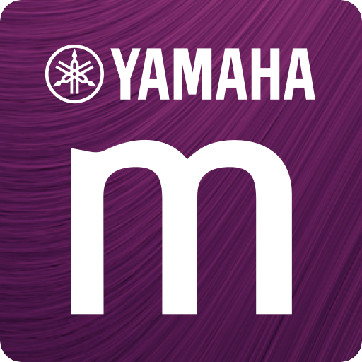

# MusicCast { width=70 align=right }

Music Assistant has support for [MusicCast](https://au.yamaha.com/en/products/contents/audio_visual/musiccast/index.html) devices. Contributed and maintained by [Fabian Munkes](https://github.com/fmunkes)

## Features

- MusicCast devices are auto detected by Music Assistant
- MusicCast devices will play in perfect sync when grouped
- Crossfading and metadata is supported
- A source can be specified to switch to when a player leaves a group
- MA will show metadata if the player is playing non-MA content
- Source selection of the MusicCast device is possible

## Settings

In addition to the [Individual Player Settings](../settings/individual-player.md) the MusicCast provider also some unique settings in the `Generic settings` section for devices which support multiple zones

- <b>Switch to this non-net source when leaving a group.</b> Players have to switch inputs when leaving a group. This option defines which input is selected. It is recommended to select a source that is unused so that unexpected sound output does not occur upon input switching
- <b>Turn off the zone when it leaves a group.</b> Toggle defines the power behaviour when the player leaves a group

## Known Issues / Notes

- Supported devices are those from circa 2015 and later
- If a device has multiple zones (i.e. main + max 3 others) only one of these zones can be streamed to. However, if streaming to main, the other zones can be joined to that player. This is a limitation of the Yamaha devices. Only one network connection is possible at a time and therefore only one network input can be active at a time. This means a different non-network source must be selected by MA when the device leaves a group. It also means that attempting to use the `Select Source` option to set two different network sources will result in unexpected behaviour 
- The main zone cannot be successfuly joined to a non-main zone. Attempting to do so will result in unexpected behaviour
- When grouping multiple devices which have multiple zones and it is desired that two or more of the device's zones will be joined, the main zone of the joining device must be added first and then the non-main zones can be joined. If only a single zone of another device is to be grouped then that can be done at any time
- The HA integration and MA integration can be used alongside each other but is not advisable to do so as duplicate player entities will get created unnecessarily
