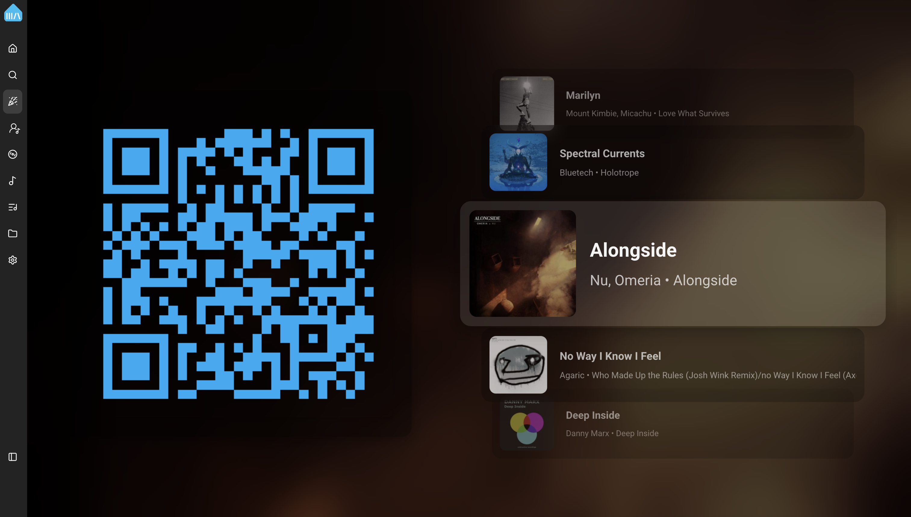
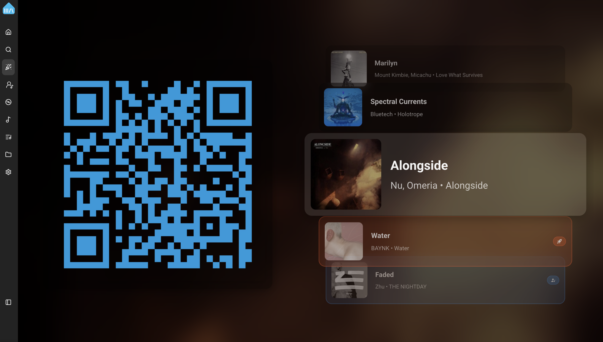
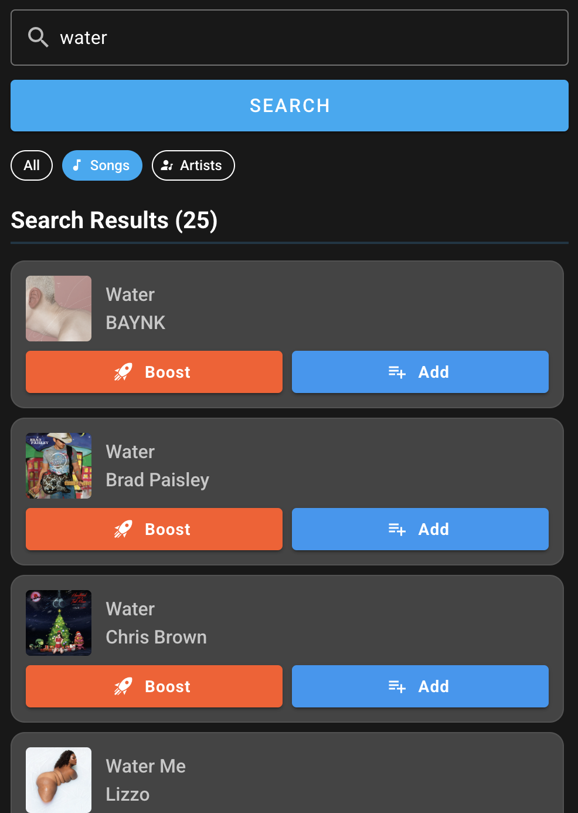

# Party Mode Plugin

Party Mode lets your guests add their favorite songs to the queue just by scanning a QR code, no logins or accounts needed! Just display the party mode dashboard on a TV or device of your choice. Guests have a dedicated UI page with no access to your system controls. With optional rate limits you can keep things fair.

## Features

- **Guest Access via QR Code** - Generate a shareable QR code that guests scan to access the song request interface
- **Mobile-Optimized Guest View** - Clean, touch-friendly interface designed for phones
- **Search & Request Songs** - Guests can search your music library and streaming services
- **Configurable Rate Limiting** - Token-based system prevents queue flooding
- **Party Dashboard** - Display the queue and QR code on a TV, monitor, or tablet
- **Remote Access Support** - Works with Music Assistant's remote access so guests don't even need to be connected to your local network or wifi

## How It Works

### For the Host

1. Enable the Party Mode plugin in Music Assistant settings
2. Configure which player will be used for party mode
3. Navigate to the Party View (`/party`) to display the QR code and current queue
4. Optionally display this on a TV or dedicated screen

### For Guests

1. Scan the QR code with a phone camera
2. The guest view opens automatically in a browser
3. Search for songs by name or artist
4. Tap "Add" to add to the queue, or "Boost" to play sooner
5. View the current queue and see when their songs will play

## Configuration

### Basic Settings

| Setting | Description |
|---------|-------------|
| **Enable Guest Access** | Master toggle for the entire feature. When disabled, all guest tokens are revoked. |
| **Party Mode Player** | Select which player/queue receives guest requests. If not set, uses the active player. |
| **Album Art Background** | Display blurred album art or a solid color as the background. |
| **Show Player Controls** | Show playback controls in the party view. Disable for a clean "digital signage" look. |

### QR Code Settings

| Setting | Description |
|---------|-------------|
| **Show Instruction Text** | Display helper text below the QR code |
| **Instruction Text** | Customizable text (default: "Scan to join!") |

### Rate Limiting (Advanced)

Rate limiting uses a "token bucket" system. Each guest has a pool of tokens that refill over time. When tokens run out, they must wait for them to refill.

!!! tip "Disabling Rate Limiting"
    Set "Enable Rate Limiting" to off to give guests unlimited requests. Individual features (Add, Boost, Skip) can still be disabled separately.

#### Add to Queue

| Setting | Default | Description |
|---------|---------|-------------|
| **Allow Add to Queue** | On | Let guests add songs the queue (prioritized before normally added songs, but after any "Boost" songs) |
| **Token Limit** | 10 | How many songs a guest can add before waiting |
| **Refill Rate** | 2 min | Time to regenerate one token |

#### Boost

| Setting | Default | Description |
|---------|---------|-------------|
| **Allow Boost** | On | Let guests boost songs to play next (queue jumping) |
| **Token Limit** | 3 | How many "Boost" requests before waiting |
| **Refill Rate** | 20 min | Time to regenerate one token |

#### Skip Song

| Setting | Default | Description |
|---------|---------|-------------|
| **Allow Skip Song** | On | Let guests skip the currently playing song |
| **Token Limit** | 1 | How many skips before waiting |
| **Refill Rate** | 60 min | Time to regenerate one token |

### Badge Colors (Advanced)

Customize the colors of badges shown on guest-requested songs in the queue:

- **Request Badge Color** - For songs added to the queue (default: Blue)
- **Boost Badge Color** - For priority requests (default: Orange)

## User Interface

### Party View (Host Dashboard)

Access via `/party` in the Music Assistant interface. This view is designed for display on a TV or monitor at your party.

**Features:**

- Large QR code for easy scanning
- Animated track stack showing previous, current, and upcoming songs
- Guest request badges visible on queue items
- Optional album art background with blur effect
- Optional player controls for the host

!!! tip "Clean Display Mode"
    For a completely frameless dashboard without side navigation, enable **Force Mobile View** in Settings → User Interface. This removes all navigation elements, leaving only the party view content - perfect for dedicated displays or kiosk mode.

### Guest View (Mobile Interface)

Guests are automatically redirected here after scanning the QR code.

**Features:**

- Search bar with filter chips (All / Songs / Artists)
- Smart search ranking using relevance and popularity
- Artist drill-down to browse an artist's tracks
- Current queue display with position indicators
- Token counters showing remaining requests
- "Request" and "Boost" badges on songs they've added

## Remote Access

When [Remote Access](../settings/remote-access.md) is enabled, the QR code URL uses `app.music-assistant.io`, allowing guests to connect from anywhere via WebRTC - even if they're not on your local network.

When remote access is disabled, guests must be on the same network as your Music Assistant server.

## Known Issues / Notes

- Guest sessions expire after 8 hours and require a new QR code scan (but refreshes if the session is used before it expires)
- The guest user shares a single "guest" account - individual guest tracking is not available
- When the plugin is disabled or removed, all active guest sessions are immediately revoked
- Rate limiting tokens are stored in the guest's browser - clearing browser data resets their limits
- The party view works best on landscape displays; the guest view is optimized for portrait (mobile)

## Tips for Hosting

1. **Display the Party View** - Use a spare tablet, TV, or monitor to show the QR code and queue
2. **Pre-populate the queue** - Add some songs before guests arrive to set the mood
3. **Adjust rate limits** - For smaller gatherings, you might disable rate limiting entirely
4. **Use a dedicated player** - Configure a specific player for party mode to avoid conflicts with other rooms
5. **Enable remote access** - If some guests might be on cellular data, enable remote access so the QR code works for everyone
