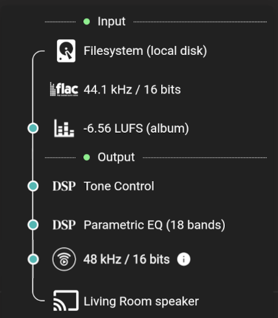
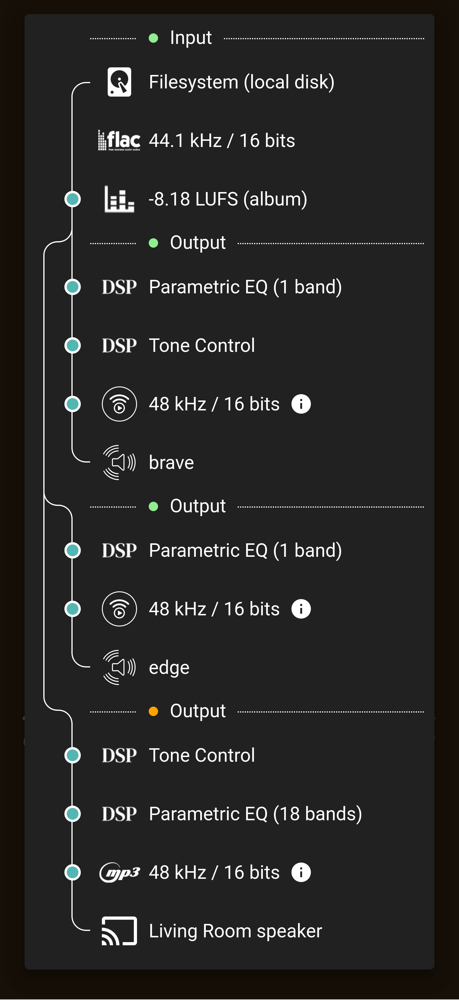

# Stream Details

## Basic View

This view shows the complete path that the stream travels. A blue dot on the line on the left shows that a modification has been made to the stream at that point.

The view is broken into two sections, Input and Output. The coloured dot on the section title indicates the Audio Quality available as the stream leaves the section. Orange indicates a lossy codec is in use. Green Indicates a lossless codec is in use. Cyan indicates a lossless codec is in use and either the sample rate is above 48kHz or the bit depth is above 16 (also known as "Hi-Res").

The Input section shows the origin of the stream and the codec, sample rate and bit depth. All tracks are processed internally as raw [PCM](https://diyodemag.com/education/what_is_pcm_pulse_code_modulation) by Music Assistant and are decoded to 32 bits floating point in the sample rate of the source. 

Next the Volume Normalization value is shown. Details about how Volume Normalization is applied can be found on the [Technical Information](faq/tech-info.md/#volume-normalization) page.

The Output section is then shown which, in this example, is simple and just shows that DSP is not supported, that no change to the audio quality has occurred and then has an icon of the player provider and the name of the player.

MA, by default, sends lossless audio to the player. The exact codec, sample rate or bit depth that are sent to the player depends on the player / provider and is always shown. Changes to the original stream will occur if the MP3 option has been selected in the player settings (See the [Groups](#groups) example below) or if the stream is resampled to match the players maximum or native sample rate. PCM could be sent to the player although typically FLAC is used to save some bandwidth.

The maximum sample rate that can be expected can be found in the [Player Providers summary table](player-providers/index.md). This can be further limited if changes were made to the default options for the player's `Sample Rates Supported by this Player` advanced setting.
***************************************************************
## Digital Signal Processing

In this example [DSP](player-support/index.md/#dsp-settings) has been enabled. High level information about the DSP filters which have been applied are shown. A tooltip is available to explain why the DSP is disabled if that is the case.
***************************************************************
## Groups
{ width = 455 }

The view will expand as necessary to show all [grouped players](faq/groups.md).
