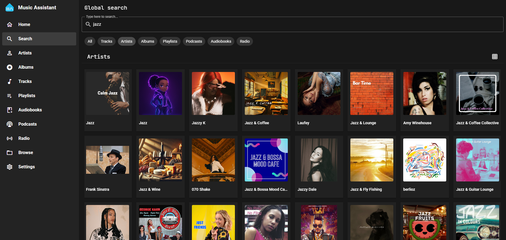
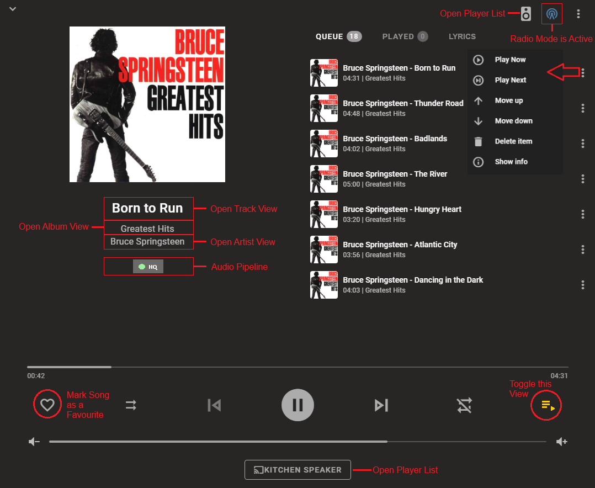
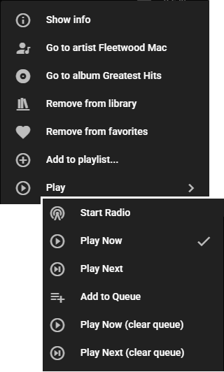
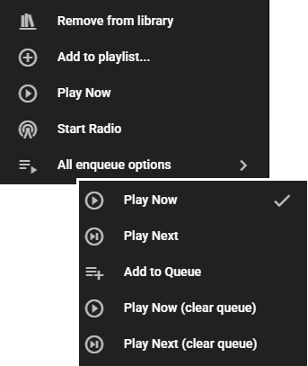

# User Interface

## Main Menu

This menu's appearance can be configured in the settings. It can be placed vertically on the left (as shown) or horizontally at the bottom. The options are displayed in the order they were selected. Any of the options can be hidden. If the settings icon is hidden from this menu it is available in the top right of the HOME screen.

!!! warning
    If you remove both the Home and Settings icons then you will be locked out. In that case you will need to manually enter the path (e.g. `http://192.168.1.166:8095/#/settings/frontend`) or clear the browser cookies to regain access to the settings page.

When visiting Browse you will only see what is already in the Library of the Streaming Providers. For the local Providers you will see all files and if a folder is visited that is not already in the MA Library it will be automatically added even if it has been previously removed.
***************************************************************

## Global Search

Searches can be done via any combination of words or partial words and also via a URL to a provider such as `https://open.spotify.com/album/0BwWUstDMUbgq2NYONRqlu` 

Initially, the view defaults to ALL which is limited to a maximum of 8 items in the seven categories of Tracks, Artists, Albums, Playlists, Podcasts, Audiobooks and Radio. 

Selecting a specific category will then show a maximum of 50 items. Context sensitive menus are available for each. If the item desired is not found then narrow the search term or navigate to the artist and all available albums and tracks should be shown in that view.
***************************************************************

## Player Bar

The [Audio Pipeline](audiopipeline.md) selectable label shows, via a coloured icon and two letters, the quality of the audio output (Low Quality, High Quality and Hi-Res). An orange circle and LQ indicate a lossy codec in use, a green circle and HQ indicates a lossless codec in use, and a cyan circle and HR indicates a lossless codec and [High Resolution sample rate or bit depth](player-support/index.md/#audio-quality). For groups, where the quality varies between players, the highest quality available will be indicated. 
***************************************************************

## Player List

!!! note
    The volume shown against a player group is the AVERAGE of the volumes of each individal player. When the group volume is changed then each player is changed by a proportionate amount.

When a player group is powered on the members of that group will disappear from the player list and individual playback to those players will not be possible. In order to playback to an individual player then either power off the group or remove the player from the group.

!!! note
    The MDI icon shown against each player can be changed in the player settings.
***************************************************************

## Grouping Players

There are four ways to group players

1.   **[TEMPORARY SYNC GROUP.](faq/groups.md#temporary-sync-group)** As shown in the [Player List](#player-list) section players can be linked via the checkbox in the player list. Only like player types that support synced playback are allowed to be joined. These players will then play in sync. It should be noted that when players are grouped in this way only the main player holds the queue. 
2.   **[SYNC GROUP.](faq/groups.md#sync-groups)** Create a (permanent) group player via the settings. In addition to playing in sync the group will also keep the queue on the group player instead of one of its child players.
3.   **[UNIVERSAL GROUP.](faq/groups.md#universal-groups)** This allows grouping of dissimilar player provider types but carefully note the potentional limitations on the linked page.
4.   **NATIVE GROUP.** Use the native functionality to group players offered by some player provider types (e.g. Google Cast)

With TEMPORARY SYNC GROUPs the number of players being streamed to can be seen due to the naming convention. In the example image below there are three players in the group.

!!! note "Note"
    If an attempt is made to power on a group and a member of that group is already a member of another powered on group then an error will be shown.

!!! note "Note"
    If a player is taken over by another app, MA will not have knowledge of that, and the group may no longer function correctly. Additionally, if a player of a syncgroup tries to join late (e.g. it was unpowered) it will not be synced to the group.
***************************************************************

## Now Playing View

This view will change depending on screen width. With wider displays you will be able to see the track that is playing (and associated information) as well as the queue and player selection is available at the bottom. With narrow displays you need to use the toggle in the bottom right to switch between the currently playing information and the queue and the player selection is available via a smaller speaker icon at the top. Adjustments to the queue can be done with the ⋮ menu on the right.

You can also access the [Now Playing view directly via URL](faq/how-to.md/#access-the-now-playing-view-directly-via-url)

The [Audio Pipeline](audiopipeline.md) selectable label shows, via a coloured icon and two letters, the quality of the audio output (Low Quality, High Quality and Hi-Res). An orange circle and LQ indicate a lossy codec in use, a green circle and HQ indicates a lossless codec in use, and a cyan circle and HR indicates a lossless codec and [High Resolution sample rate or bit depth](player-support/index.md/#audio-quality). For groups, where the quality varies between players, the highest quality available will be indicated.

When the favourite icon is solid then selecting that will bring up two options - `Remove from Favorites` and `Add to Playlist`. It is possible that if the favorite status is changed from a different view after playback has commenced then the favourite status may not indicate correctly until playback of the track is restarted.
***************************************************************

## Play Button 

The play button is used as a shortcut to play the various items in the UI. It is shown on hover for non-mobile devices or is always in view for mobile devices.  

Clicking/touching the Play Button will either immediately play the item or show the play menu. To ensure the user doesn't accidentally play on the wrong player, the play menu will show:

- the first time the MA view is entered; or
- if the player is not playing (or paused)

!!! note "Note"
    If there is ever uncertainty as to whether the item will immediately start playing use a right click or long press to bring up the menu.

***************************************************************

## Track Menu

In any of the following views, Right click or long press on a track to get the following menus

The START RADIO option will only be seen if there is a provider that supports it. Start Radio populates the queue with tracks based on the selected track. The tracks are selected by the provider not MA. 
***************************************************************

## View - Artist / Album / Track

Album and Track Views look the same as the above except there is no album artist filter icon and the track view has an [ADD VIA URL](music-providers/builtin.md) option.

A red dot on the search icon 
indicates that the viewed results are subject to filtering by search. This is useful if the search box has been closed.

A red dot on the refresh icon 
indicates that the viewed results have some sort of update pending. Press the refresh button.

The Sync icon  will synchronise the library with all of the providers that support that mediatype.

Items in all views can be "right clicked" or "long pressed" to bring up an extensive menu of options which is the same as that accessed by the ⋮ menu on the right. In the image above the complete list of possibilities is shown and this will vary slightly depending on the current view.

Multiple selections of albums / artists / tracks is possible by clicking the multi-select icon. Once one or more items are selected then clicking on the "ACTIONS" at the bottom

will bring up this menu

The behaviour described above will work on any view where you see the "x item(s) selected" text.
***************************************************************

## View - Individual Artist

The tracks and albums sections are collapsible. The view above shows them both collapsed. The tracks section shows ALL tracks that are in the library or that are available across all of the providers. A red dot on the library icon  indicates that the viewed results are filtered to only show items that are in the library. To see what albums any given track is on you can either sort alphabetically or click on one and use the context menu and SHOW INFO.

The album section has an additional filter option. You can choose to filter by or in any combination of ALBUM, SINGLE, COMPILATION, EP or UNKNOWN album types.

Expanding the IMAGES section allows for the selection of Thumb, Fanart or Logo. The other types shown are not used in the UI at this time. If there are no or limited images shown or the Images section is missing then go to the ⋮ menu in the top right of the view and select REFRESH ITEM. Right click on an image to make it the primary to be used. (Similar functionality is also available in the album view for Thumb)

The PROVIDER DETAILS section shows from where the albums and tracks listed above were obtained. It is normal to have multiple entries here if an artist has aliases or there are variant spellings, use of punctuation etc.  The ID shown against the streaming provider may be used in automations and scripts.
***************************************************************

## View - Track "Show Info"

!!! note
    The PROVIDER DETAILS section in this view also has the functionality to play a short part of the track as a preview
***************************************************************

## View - Browse

Entering the Browse view will present a list of the installed [Music Providers](music-providers/index.md). Selecting one of those will show a relevant list of the items from that provider that can be browsed. 

!!! warning "Caution"
    Be careful once browsing within the provider as selecting PLAY on a folder will play everything in that folder and all sub-folders. Attempting to play thousands of tracks may consume an excessive amount of system resources on the host and cause MA to crash or become unresponsive.

It is this view that is used to select radio stations from the [Radio Browser](music-providers/radio-browser.md) provider.

